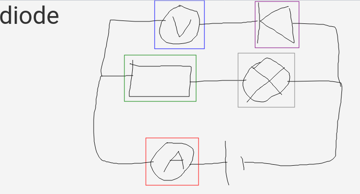
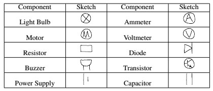

# Circuit Painter

> This is the source code corresponding to paper [*Graph-Based Locality-Sensitive Circuit Sketch Recognition*](http://47.103.30.151/research/GraphBasedLocalitySensitiveCircuitSketchRecognition.pdf), written by Liu Songhua, Nanjing University.

Request Environment: Java 11.0.7, python3, pytorch, maven, numpy, matplotlib

In order to run this program, firstly, you need to download our pre-trained classifier model from [here](http://47.103.30.151/data/LeNet.pt), and then move it to directory [Project Root]/src/main/resources/py/model/LeNet.pt. 

After the model is ready, run:

```shell
python src/main/resources/py/classifier.py
```

under the project root directory.

At last, you can run this code at your local space. You can also deploy this code on a server. If you run:

```shell
mvn jpro:run
```

and you can open the app in web browser (useful for user study):

```shell
http://localhost:8080/index.html
```

When running, you can draw freely on the panel. When the app detects a circuit element, the name of it will display at the left-top corner of the panel, and it will be specified by a rectangle with corresponding color. 



The supported circuit elements are shown below:



